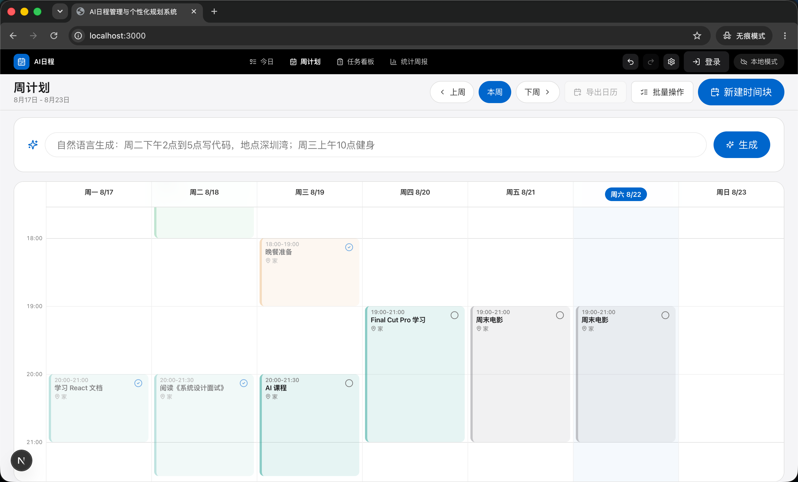
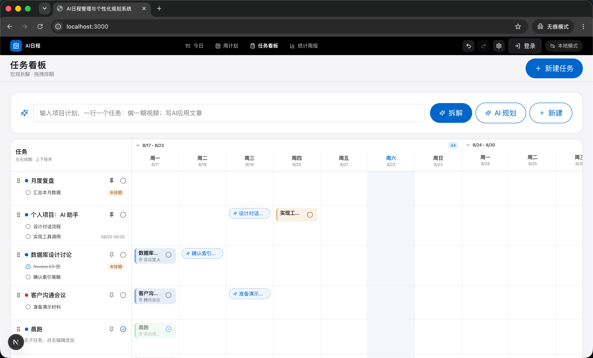
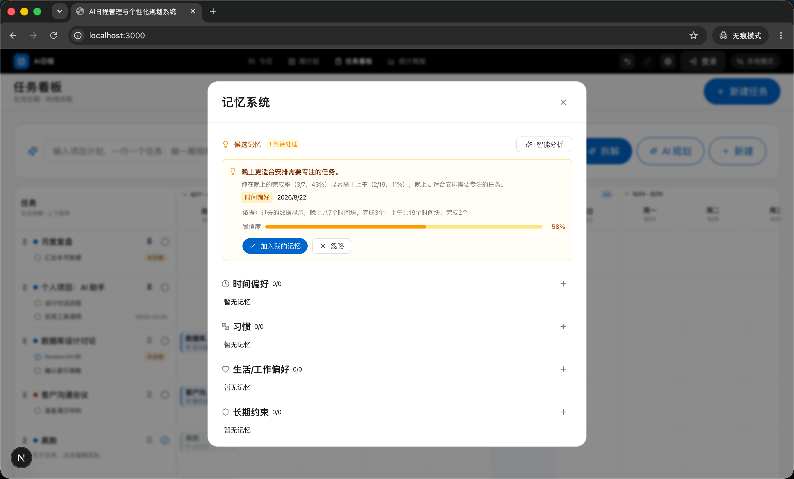

# AI日程管理与个性化规划系统

用自然语言拆解宏观计划，用周计划与任务看板双视图落地微观执行。

在线体验：<https://ai-schedule-web-ten.vercel.app>

## 快速开始

需要 Node.js、Python 3.12+ 与 [uv](https://docs.astral.sh/uv/)。

```bash
npm install
uv sync --project backend --extra dev
npm run dev
```

打开 <http://localhost:3000>。`npm run dev` 会同时启动 Next.js 前端（3000）与 FastAPI 后端（8000）。

首次使用无需配置任何环境变量：本地 NLP 规则可直接解析中文日程，数据保存在 localStorage。需要云同步或 AI 解析时，复制 `.env.example` 为 `.env.local` 后按需填写。

## 功能

- **自然语言建日程**：`周二下午2点到5点写代码，地点深圳湾` 自动解析为时间块；未配置 AI Key 时回退本地 NLP 规则
- **周计划**：7×24 小时时间轴，拖拽调整、完成打卡、地点与类目标注
- **任务看板**：任务列表 + 14 天排期网格，AI 将宏观目标拆解为任务/子任务并规划不冲突的时间块
- **今日待办四象限**：紧急/重要矩阵，移动端单列、桌面端双栏
- **定时提醒**：时间块内设置提醒时间，支持企业微信 / PushPlus / Server酱推送
- **Obsidian 集成**：粘贴笔记链接即可跳转到对应笔记
- **撤销/重做与统计周报**：50 步历史栈；类目时长、完成率与 Markdown 周报导出
- **本地优先 + 可选云同步**：默认 localStorage，登录 Supabase 后按用户隔离同步

## 界面预览


*周计划 7×24 小时时间轴：拖拽调整、完成打卡、地点与类目标注*


*任务看板 14 天排期网格：任务列表、子任务拆解、时间块与任务双向联动*


*记忆系统：管理长期偏好、习惯与生活/工作约束，AI 自动生成候选记忆*

## 技术栈

| 层 | 技术 |
| --- | --- |
| 前端 | Next.js 15 · React 19 · Tailwind CSS 4 · Lucide React |
| 后端 | FastAPI · Python 3.12+ · AI 代理（OpenAI / DeepSeek，用户自备 Key） |
| 数据 | localStorage（默认）· Supabase（可选） |
| 测试 | Vitest（前端）· pytest（后端） |

## 配置

所有配置均有默认值，完整变量说明见 [.env.example](.env.example)。

AI 解析使用**用户自备 Key**：在应用设置页选择 OpenAI / DeepSeek 并填入自己的 API Key（仅保存在用户自己的账号数据中，随请求传给后端调用）；未填写 Key 时使用本地中文规则解析。服务端 `OPENAI_API_KEY` / `DEEPSEEK_API_KEY` 仅供 golden 评测链路使用。

| 场景 | 关键变量 |
| --- | --- |
| 云同步 | `NEXT_PUBLIC_SUPABASE_URL`、`NEXT_PUBLIC_SUPABASE_ANON_KEY` |
| AI 解析 | `AI_PROVIDER`（请求未带 provider 时兜底）；服务端 Key 仅评测用 |
| 微信提醒 | `WECHAT_PUSH_TYPE`、`WECOM_WEBHOOK_URL` / `PUSHPLUS_TOKEN` / `SERVERCHAN_KEY` |
| 定时提醒 | `ENABLE_SCHEDULER`、`CRON_SECRET`（Serverless 模式必填） |

## 部署

前后端均已适配 Vercel Serverless，可一键部署；完整部署步骤、环境变量清单与定时提醒配置（Vercel Cron / GitHub Actions）见 [docs/operations.md](docs/operations.md)。

- 前端：<https://ai-schedule-web-ten.vercel.app>
- 后端：<https://ai-schedule-backend.vercel.app>

## 目录结构

```text
src/          Next.js 前端（App Router、组件、状态）
backend/      FastAPI 后端（解析、调度、提醒、AI 代理）
supabase/     Supabase 建表与 RLS 脚本
deploy/       部署与运维配置
docs/         运维、安全等详细文档
```

## 本地检查

```bash
npm test                                # 前端 Vitest
cd backend && .venv/bin/python -m pytest -q   # 后端 pytest
npm run lint                            # ESLint
npm run scan:secrets                    # 密钥扫描
```
